<div align="center">
  <picture>
    <source media="(prefers-color-scheme: dark)" srcset="assets/banner-dark.svg">
    
  </picture>
</div>

```js
> gowtham.init()

{
    role      : "AI Engineer · Full-Stack Engineer",
    builds    : ["agentic RAG", "evals-gated LLM pipelines", "production Next.js", "3D web"],
    shipped   : "nutrigreenz.farm · LogicGen · AumicFlow · NXT Schools",
    previously: "AI Consultant @ CUBIXSO (Dec 2024 to Sep 2026), 10+ client engagements",
    status    : "open to AI Engineer and Full-Stack roles",
    location  : "Hyderabad, India"
}
```

### `$ ls ~/skills/`

<picture>
  <source media="(prefers-color-scheme: dark)" srcset="assets/skills/ai-dark.svg?v=3">
  
</picture>

<picture>
  <source media="(prefers-color-scheme: dark)" srcset="assets/skills/ml-dark.svg?v=3">
  
</picture>

<picture>
  <source media="(prefers-color-scheme: dark)" srcset="assets/skills/frontend-dark.svg?v=3">
  
</picture>

<picture>
  <source media="(prefers-color-scheme: dark)" srcset="assets/skills/backend-dark.svg?v=3">
  
</picture>

<picture>
  <source media="(prefers-color-scheme: dark)" srcset="assets/skills/cloud-dark.svg?v=3">
  
</picture>

### `$ ls ~/projects --featured`

| Project | What it does | Stack |
|:--|:--|:--|
| **[Nutri Greenz](https://nutrigreenz.farm)** | Live farm-to-table storefront and operations portal. 118 API routes, UPI checkout with idempotent payment reconciliation, per-admin 2FA and RBAC, cleared an external VAPT audit. | Next.js 16 · React 19 · Supabase · Vercel |
| **LogicGen** | Agentic RAG that turns credit-underwriting policy into executable DMN and Drools rules, with human-in-the-loop review. 100% valid DMN at 90%+ extraction coverage on a self-hosted model. | FastAPI · Mistral 7B · pgvector · Next.js |
| **AumicFlow** | Generative storytelling with streaming chat and voice input. RAG to HyDE to context-aware generation; sub-query caching cut latency from 1-2 min to near real-time. | LangChain · FAISS · Claude · React 19 |
| **[AI Timetable Engine](https://github.com/gowtham-creator/AI-Timetable-NXT-Schools)** | Clash-free timetables for a production school ERP. A deterministic solver builds the schedule; the LLM only reads the rules. 270/270 periods placed. | Yii2 · Gemini · Claude |
| **[NXT School ID](https://github.com/gowtham-creator/nxt-schools-id)** | ID-card platform with a template designer, bulk Excel import, and print-ready CR80 and QR IDs. | Next.js 16 · Supabase RLS · Playwright |
| **[Cubixso.com](https://www.cubixso.com)** | Immersive 3D agency site with a custom design system, scroll choreography, and device-adaptive WebGL with fallback. | Three.js · React Three Fiber · GSAP |

### `$ git log --graph`

<div align="center">
  <picture>
    <source media="(prefers-color-scheme: dark)" srcset="assets/stats/overview-dark.svg">
    
  </picture>
  <picture>
    <source media="(prefers-color-scheme: dark)" srcset="assets/stats/languages-dark.svg">
    
  </picture>
</div>

<div align="center">
  <picture>
    <source media="(prefers-color-scheme: dark)" srcset="https://raw.githubusercontent.com/gowtham-creator/gowtham-creator/output/snake-dark.svg">
    
  </picture>
</div>

### `$ cat ~/achievements.txt`

```text
Microsoft for Startups ......... Founder Member
AWS Build Accelerator .......... 10-week global founders program
Google for Startups ............ AI Academy
Buildspace Season 5 ............ top 7.4% of 70,000
MATHADEMIA (T-Hub x DST) ....... Top 10 AI startups of 10,000
Teams led ...................... up to 20 engineers (SLiYP), 15 (Ava.ai)
```

### `$ ping gowtham`

<a href="https://www.linkedin.com/in/gowtham-reddy-nayini-821aa41b3/"><code>linkedin</code></a> · <a href="mailto:gowtham5.gr15@gmail.com"><code>email</code></a> · <a href="https://github.com/gowtham-creator?tab=repositories"><code>repositories</code></a>

```
gowtham@github:~$ echo "building AI that ships, not demos"
building AI that ships, not demos
```

<sub>Skill icons from <a href="https://github.com/glincker/thesvg">thesvg</a>. Banner, skill tiles and stats cards are generated by the scripts in this repo and refreshed daily by GitHub Actions.</sub>
